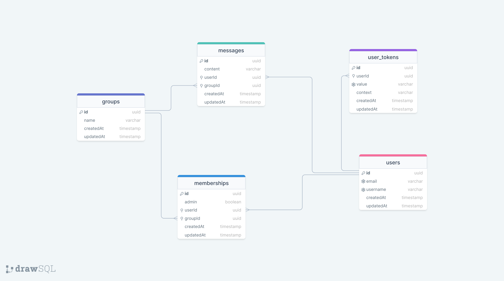

# Groupchat API

API for a realtime group chat application.

This API is hosted on the [Render free tier](https://render.com/docs/free#free-web-services), which will sleep after 15 minutes of inactivity. This can cause a response delay of up to 30 seconds for the first request that comes in after a period of inactivity.

The PostgreSQL database is hosted on [bit.io](https://bit.io/).

The Redis instance is hosted on [Upstash](https://upstash.com/).

If you don't want to clone the project locally and play around (see below), either use your own frontend or a client (like [Banana Cake Pop](https://chillicream.com/docs/bananacakepop)) to interact with the hosted API.

## Tech

- Node
- TypeScript
- Nest.js
- Knex
- PostgreSQL
- Redis
- GraphQL

## Features

- Auth (register, login, logout, logout from all devices)
- Groups
- Join group via an invite token (JWT) that expires in 10 minutes
- Leave group
- Messages
- Group permission based on role (group admin, normal member)
- Realtime update to new message added via GraphQL subscription

## Database schema



## Getting started

Clone the repo and install dependencies

```
$ git clone https://github.com/ntson/groupchat-api.git
$ cd groupchat-api
$ npm install
```

Make sure to check the `src/config/knexfile.ts` and create the development and testing databases.

Create the `.env` file at the project root following the `.env.example` file.

Run database migration

```
$ npm run db:migrate:local
```

Start the development server

```
$ npm run dev
```

Run the test

```
$ npm test
```

Build the app

```
$ npm run build
```

Start the production server

```
$ npm start
```
